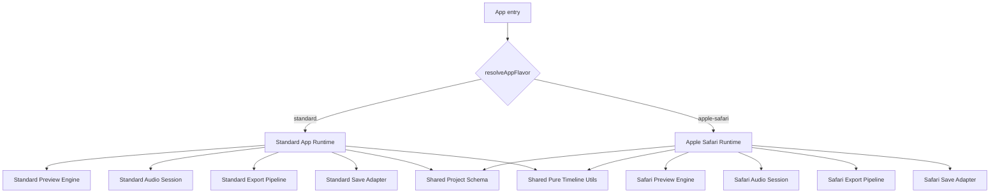

# タートルビデオ プラットフォーム分離再設計方針

作成日: 2026-04-12

## 1. 目的

現状のコードを前提に、タートルビデオが根本的に解決すべき課題を整理し、
Android/PC 系と Apple Safari 系の処理を相互干渉しない形へ再設計できるかを検討する。

本書では次を示す。

- 現状コードから見える根本課題
- Android/PC 系と Apple Safari 系を分離することの可否
- 分離する場合の仕様方針
- 段階的な実装計画

## 2. 結論

### 2.1 対応可否

対応は可能である。

ただし、現状のまま `if (isIosSafari)` を増やしていく方向ではなく、
実行系を二系統に分ける再設計が前提になる。

推奨するのは次の構成である。

- Android/PC 系: 高機能・拡張重視の標準ランタイム
- Apple Safari 系: 安定動作を最優先する互換ランタイム
- 共通で残すもの: プロジェクトデータ形式、純粋なタイムライン計算、受動的な UI 部品
- 共通に残さないもの: 再生制御、AudioContext 制御、プレビュー音声経路、エクスポート経路
- 保存 I/O の実装詳細は、Safari 側に独自要件が顕在化した場合に分離対象とする

### 2.2 判断理由

現状コードでは、プラットフォーム差分を utility や policy に集約し始めているものの、実際の処理はまだ巨大な共有ランタイムの中で分岐している。
そのため Safari 向け修正が Android/PC 向けの既定経路へ波及しやすい。

特に次の点が大きい。

- `src/App.tsx` は常に単一の `TurtleVideo` を起動している
- `src/components/TurtleVideo.tsx` に preview、audio routing、seek、visibility 復帰、export 前提の処理が集中している
- `src/hooks/useExport.ts` は strategy を持ちつつも、Safari と非 Safari の中核処理を依然として共有している
- `src/utils/previewPlatform.ts` は実用的な policy レイヤーだが、現状は共有ループの外へ責務を押し出し切れていない

したがって、今後 Android 側を機能強化し、Safari 側を安定重視にするのであれば、
「同じアプリ内で同じランタイムを分岐で延命する」方針は限界に近い。

## 3. 現状コードから抽出した根本課題

## 3.1 単一ランタイムに責務が集中している

現状の実行入口は 1 本である。

- `src/App.tsx`: 単一の `TurtleVideo` を常に描画
- `src/components/TurtleVideo.tsx`: 再生、停止、seek、visibility 対応、音声 routing、export 前提の同期まで一括保持

この構造だと、どのプラットフォームでも同じ再生エンジンを通る。
Safari 専用の回避策が Android/PC の既定経路に混ざるのは構造上自然であり、運用では防ぎ切れない。

## 3.2 プラットフォーム差分が shared loop に残っている

`src/utils/platform.ts` と `src/utils/previewPlatform.ts` で capability 判定や policy 集約は進んでいるが、
肝心の実行は `TurtleVideo.tsx` 内で継続している。

ここで重要なのは、`previewPlatform.ts` 自体を捨てることではない。
既存の policy レイヤーは再利用価値が高い一方、shared loop を延命する置き場所として使い続けるべきではない、という点にある。

具体的には次のような分岐が共有ループに残っている。

- `renderFrame`
- `startEngine`
- `stopAll`
- inactive video の `pause/play` 制御
- native audio と WebAudio の切り替え
- visibility 復帰時の AudioContext resume

この状態では、Safari 向けの 1 条件変更が preview 全体の挙動を変えうる。

## 3.3 Export strategy の分離がまだ浅い

`src/hooks/export-strategies/exportStrategyResolver.ts` と
`src/hooks/export-strategies/iosSafariMediaRecorder.ts` により、
strategy 分離の土台自体はある。

しかし実際には `src/hooks/useExport.ts` が次を広く抱え込んでいる。

- Safari 用の offline audio pre-render
- Safari 用の video 要素経由音声抽出
- WebCodecs pipeline
- TrackProcessor / ScriptProcessor の分岐
- muxer / encoder / timeline の管理

さらに `shouldUseOfflineAudioPreRender()` は `isIosSafari` を受け取っているのに、
現実装では「音声ソースがあれば true」を返している。

これは Safari 向け前処理が非 Safari 側にも共有されている可能性を示すが、
既存テストを見る限り、全プラットフォームでの品質向上のために意図的に共通化されている可能性もある。

したがってここは「現時点の不具合」と断定せず、Phase 4 で非 Safari 側の品質影響を検証したうえで、
Safari 専用に戻すのか、明示的な共通戦略として残すのかを再評価する。

## 3.4 保存と I/O も単一路線で運用している

`src/stores/projectStore.ts` は全プラットフォーム共通で IndexedDB を前提としている。
`src/utils/fileSave.ts` は capability ベースでダウンロード経路を分けているが、保存の永続化全体は flavor ごとに分かれていない。

ただし、現状コードを確認する限り、ここは preview / audio / export ほど切迫した分離対象ではない。
Safari 側だけ独自の保存 UX や外部保存経路が必要になった時点で adapter 化できるようにしておく、という位置づけが妥当である。

## 3.5 テストが flavor 境界を守る設計になっていない

純粋関数テストは増えているが、
Safari 特有のライフサイクル回帰を検知する層が不足している。

既存メモでも次が確認されている。

- video -> image -> video と BGM を含む iOS 回帰テストが不足
- shared helper を変更すると preview 側の回帰確認が必要

今後も shared runtime を前提に修正を続ける限り、
テストで守るべき境界が増え続ける。

## 4. いま問題になっていることの本質

本質的な問題は「Apple の処理と Android/PC の処理が違うこと」ではない。

本質は次である。

- 振る舞いの違う処理を、1 つの再生エンジンと 1 つの export 中核で扱っている
- 分離すべき責務が utility 化だけで済む段階を超えている
- 将来の開発方針がすでに分岐している
  - Android/PC: リッチ機能を伸ばしたい
  - Safari: 基本機能の安定動作を重視したい

つまり課題は「条件分岐の管理」ではなく「ランタイム分割の不足」である。

## 5. 推奨方針

## 5.1 方針の要点

今後は feature 共通化ではなく、runtime を二系統化する。

ただし、すべてを完全複製するのは推奨しない。
完全複製すると project 互換性や修正コストが悪化するためである。

本プロジェクトで本当に分離すべきなのは次である。

- preview runtime
- audio runtime
- export runtime

保存 I/O adapter は、Safari 側に独自要件が生じた場合の後続分離対象とする。

逆に、次は共通で維持してよい。

- `MediaItem` / `AudioTrack` / `Caption` などのデータ契約
- pure な timeline 計算
- 受動的な UI 部品
- ログ、エラー表現、定数の一部

既存の `previewPlatform.ts` や `exportStrategyResolver.ts` のような policy / resolver 層は、
廃棄対象ではなく flavor 内部の判断ロジックとして再利用する前提で扱う。

## 5.2 目標アーキテクチャ



save adapter の二系統化は最終候補であり、Phase 1〜4 の必須条件ではない。

## 5.3 分離後の役割

### Standard Runtime

- 対象: Android Chrome、PC ブラウザ、将来的な高機能路線
- 方針: 機能追加、性能改善、将来的な高度化を優先
- export: WebCodecs を中心に進化
- preview: 通常の play/pause/sync を標準系として保守

### Apple Safari Runtime

- 対象: iPhone / iPad の Safari を主対象とし、必要なら macOS Safari も同系統で扱う
- 方針: 基本機能の安定性を最優先
- export: Safari 用専用 pipeline を独立保守
- preview: AudioSession 保護、pause/play 回避、visibility 復帰などを Safari 専用実装として閉じ込める

## 6. 仕様案

## 6.1 Flavor 定義

```ts
type AppFlavor = 'standard' | 'apple-safari';
```

判定はアプリ入口で一度だけ行う。

```ts
resolveAppFlavor(platformCapabilities): AppFlavor
```

共有モジュール内で `isIosSafari` や `isAndroid` を直接見ることは禁止する。
platform 判定は `resolveAppFlavor` と flavor 内部に閉じ込める。

## 6.2 共通化を許可する範囲

### 共有してよい

- project schema
- pure timeline utility
- store のデータ型
- 汎用 UI 部品
- import / export される保存フォーマット

### 共有してはいけない

- preview 再生エンジン
- AudioContext の復旧戦略
- inactive video の扱い
- visibility 復帰ロジック
- export 実行 pipeline
- platform 固有の file I/O 実装

## 6.3 Safari 側の機能レベル

Safari 側は「標準機能の安定動作」を優先し、機能 parity は必須要件にしない。

最低限守る機能は次とする。

- 動画・画像の追加
- 基本的なトリミング / 表示時間調整
- BGM
- ナレーション
- キャプション
- preview の再生 / 一時停止 / 停止 / seek
- export
- 保存 / 読み込み

将来的な高度機能は standard runtime 側を先行とし、
Safari 側は後追いまたは非搭載を許容する。

## 6.4 データ互換

project データ形式は一本化を維持する。

理由は次の通り。

- Android/PC と Safari で保存ファイルが分かれると運用が煩雑になる
- 将来 runtime を二系統化しても、ユーザーの編集データまで分断すべきではない

そのため、互換ポリシーは次とする。

- 保存フォーマットは共通
- Safari で未サポートの機能は破棄せず保持
- Safari では未対応項目を警告表示または UI で制限

## 6.5 ディレクトリ構成の目安

```text
src/
  app/
    resolveAppFlavor.ts
    AppShell.tsx
  flavors/
    standard/
      StandardApp.tsx
      preview/
      audio/
      export/
      save/      # 必要になった場合のみ
    apple-safari/
      AppleSafariApp.tsx
      preview/
      audio/
      export/
      save/      # 必要になった場合のみ
  shared/
    schema/
    timeline/
    ui/
    logging/
```

## 7. 実装計画

### 進捗メモ（2026-04-12 時点）

- Phase 1 は完了。App 入口で `standard` / `apple-safari` を一度だけ解決し、選択 flavor のみ lazy load する構成へ移行済み
- Phase 2a は完了。`VisibilityManager` 相当として `src/components/turtle-video/usePreviewVisibilityLifecycle.ts`、`SeekController` 相当として `src/components/turtle-video/usePreviewSeekController.ts`、`AudioSession` 相当として `src/components/turtle-video/usePreviewAudioSession.ts`、`InactiveVideoManager` 相当として `src/components/turtle-video/useInactiveVideoManager.ts`、`PreviewEngine` 相当として `src/components/turtle-video/usePreviewEngine.ts` を抽出済み
- `usePreviewEngine.ts` へ `renderFrame`, `handleMediaElementLoaded`, `handleSeeked`, `handleVideoLoadedData`, `stopAll`, `loop`, `startEngine` を移管し、`TurtleVideo.tsx` は shared runtime の統合レイヤーへ後退した
- PreviewEngine 抽出後も `npm run quality:gate` は tests/lint/build とも通過し、Phase 2b の preview runtime 分離へ進める状態を確認した
- Phase 2b の入口として `src/components/turtle-video/previewRuntime.ts` を追加し、`src/flavors/standard/standardPreviewRuntime.ts` と `src/flavors/apple-safari/appleSafariPreviewRuntime.ts` を `StandardApp.tsx` / `AppleSafariApp.tsx` から注入する構成へ変更した
- 今回の更新で preview 用 platform capability 解決も runtime 側へ移し、`standardPreviewRuntime` は Apple Safari 分岐を抑止、`appleSafariPreviewRuntime` は Safari preview 分岐を強制する形へ進めた

## Phase 0. 文書化と境界宣言

目的:
現状の shared runtime に対して、どこまでを共有し、どこからを flavor 分離するかを明文化する。

タスク:

- 本書を作成
- flavor 境界のルールを決定
- `isIosSafari` の直参照を今後増やさない方針を合意

完了条件:

- 分離対象と共有対象が明文化されている

## Phase 1. App 入口の flavor 分離

目的:
アプリ入口で standard / apple-safari を切り替える。

タスク:

- `resolveAppFlavor()` を追加
- `App.tsx` または app shell で runtime を選択
- dynamic import / lazy load を用い、不要な flavor を初期ロードしない
- 現行 `TurtleVideo.tsx` は一旦 adapter として残す

完了条件:

- 入口で flavor 切替が一度だけ行われる
- 下位共有モジュールでの platform 判定を増やさない
- 非選択 flavor が同期 import されていない

## Phase 2a. TurtleVideo.tsx の責務分割

目的:
一番影響の大きい preview / playback 周辺を、shared のまま安全に小モジュールへ分解する。

タスク:

- `PreviewEngine` 相当へ `renderFrame`, `loop`, `startEngine`, `stopAll` を抽出
- `SeekController` 相当へ seek 系ロジックを抽出
- `VisibilityManager` 相当へ visibility 復帰ロジックを抽出
- `AudioSession` / `InactiveVideoManager` 相当へ node 管理と prewarm 制御を抽出
- 既存の `previewPlatform.ts` は shared な policy レイヤーとして維持する

進捗状況:

- 完了: `VisibilityManager` 相当の抽出
- 完了: `SeekController` 相当の抽出
- 完了: `AudioSession` 相当の抽出（audio node 管理、route refresh、audio-only prime、media ref assign）
- 完了: `InactiveVideoManager` 相当の抽出（非アクティブ video の reset）
- 完了: `PreviewEngine` 相当の抽出（`renderFrame`, `handleMediaElementLoaded`, `handleSeeked`, `handleVideoLoadedData`, `stopAll`, `loop`, `startEngine`）
- Phase 2a 完了: 次段は Phase 2b の preview runtime flavor 分離

完了条件:

- `TurtleVideo.tsx` の責務が小モジュールへ分散している
- 各モジュールが個別にテストしやすい構造になっている

## Phase 2b. Preview runtime の二系統化

目的:
Phase 2a で分割したモジュールを基に、preview runtime を flavor ごとに分離する。

タスク:

- standard preview modules を作成
- apple-safari preview modules を作成
- `previewPlatform.ts` の policy を flavor 内部の判断ロジックとして再配置または再利用する
- runtime 選択側から preview modules を差し替える

進捗状況:

- 着手: `previewRuntime` 注入境界を追加し、runtime 選択側から preview modules を差し替えられる構成へ変更
- 進行: preview 用 platform capability 解決を runtime 側へ移し、shared の `TurtleVideo.tsx` が flavor 非依存の wiring 層へさらに寄った
- 未完: standard / apple-safari で `usePreviewEngine` / `usePreviewAudioSession` などの内部実装をまだ共有しているため、実装差し替え自体は次段で進める

完了条件:

- shared 側に preview の platform 条件分岐が残らない
- Safari 修正が standard preview 実装に触れない

## Phase 3. Audio runtime の分離

目的:
AudioContext と media element の扱いを flavor ごとに分離する。

タスク:

- standard audio session を作成
- safari audio session を作成
- createMediaElementSource 再利用制約を Safari 側に閉じ込める
- visibility 復帰 / resume retry を Safari 側に閉じ込める
- 既存の `iosSafariAudio.ts` や policy 判定を Safari flavor の内部判断として整理する

完了条件:

- shared 側で AudioContext の Safari 回避策を持たない

## Phase 4. Export runtime の分離

目的:
WebCodecs 系と Safari 系の export pipeline を別実装にする。

タスク:

- `useExport.ts` を facade 化
- standard export pipeline を切り出し
- safari export pipeline を切り出し
- `shouldUseOfflineAudioPreRender()` が Safari 専用要件か全体品質向上策かを検証し、契約を明文化する
- Safari 用の offline render / MediaRecorder / fallback を Safari 側へ隔離

必要なら、非 Safari 側で共有する前処理は `shared export pre-render strategy` として明示的に残す。

完了条件:

- Safari 専用処理と shared 処理の境界が明文化されている
- Safari export 修正が standard export を変更しない

## Phase 5. Save / Load adapter の見直し（必要時のみ）

目的:
データ形式は共通のまま維持しつつ、Safari 側に独自要件が生じた場合のみ I/O 実装を分離する。

タスク:

- `projectStore` と `fileSave.ts` の capability ベース運用で十分かを再確認する
- Safari 側で独自保存 UX が必要になった場合のみ adapter 化する
- adapter 化する場合でも project schema は共通維持とする

完了条件:

- 必要なら永続化方式を flavor 単位で差し替え可能
- 必要がなければ、保留判断と理由が文書化されている

## Phase 6. UI とヘルプの分離

目的:
機能差を UI レベルで明示し、Safari 側を安定動作モードとして扱えるようにする。

タスク:

- `sectionHelp.ts` の表記を flavor ごとに整理
- Safari 側で未対応機能を出し分け
- standard 側では高度機能の開発を継続可能にする

完了条件:

- ユーザーが platform ごとの期待値を誤認しない

## Phase 7. テスト再編

目的:
shared helper の変更で片系統が壊れる構造をやめ、flavor 単位で回帰を検出する。

タスク:

- standard preview/export テストを用意
- safari preview/export テストを用意
- 共通 schema 互換テストを用意
- 既存の `previewPlatform.test.ts`、`exportStrategyResolver.test.ts`、`iosSafariAudio.test.ts` などを再配置または流用する
- iOS 回帰シナリオ
  - video -> image -> video
  - BGM 維持
  - visibility hide/show
  - seek 復帰
  - export 音声維持

完了条件:

- Android/PC 修正時に Safari 回帰が検知できる
- Safari 修正時に Android/PC 回帰が検知できる

## 8. 受け入れ条件

次を満たしたら分離完了とみなす。

- App 入口で flavor が切り替わる
- shared runtime に platform 条件分岐が残っていない
- standard runtime と apple-safari runtime のコード配置が分かれている
- export pipeline が二系統化されている
- project データ互換が維持されている
- standard 側の機能追加で Safari 側の runtime 実装を触らなくてよい
- Safari 側の安定化修正で standard 側の runtime 実装を触らなくてよい

## 9. 非推奨の進め方

次の進め方は避ける。

- `TurtleVideo.tsx` の中で `if (isIosSafari)` をさらに増やす
- previewPlatform policy を shared loop 延命のためだけに増やし続ける
- export strategy だけ分けて preview と audio を共有し続ける
- Safari 側の不具合修正を Android/PC 側の既定ロジックへ混ぜ込む

これらは短期的には速いが、今回の目的である「相互干渉の停止」を達成できない。

## 10. リスクと前提

### リスク

- 初期フェーズではファイル数が増える
- `TurtleVideo.tsx` の解体には段階的移行が必要
- 一時的に adapter 層が増えて構造が複雑に見える
- runtime 二系統化により bundle size が増えやすい

### ただし受け入れるべき理由

- 今の複雑さは runtime が 1 本に詰め込まれていることに起因する
- 複雑さを隠すのではなく、境界を明示して局所化する方が保守しやすい
- bundle size は Phase 1 の dynamic import で抑制可能である

## 11. 保留事項

現時点で仕様上の保留は次である。

- Apple Safari の対象範囲を iPhone / iPad のみにするか、macOS Safari も同じ flavor に含めるか
- Safari 側で許容する機能上限をどこまでにするか
- save/load を当面 IndexedDB 共通のままにするか、Safari 側独自 adapter を早期導入するか

ただし、これらは Phase 1 以降で詰めてもよく、
本書の中核方針である「runtime 二系統化」は変わらない。

## 12. コードベース検証結果（2026-04-12 追記）

本章は、上記方針を受けて実際のワークスペースを徹底分析した結果である。
方針の妥当性を検証し、補足・修正すべき点を記載する。

### 12.1 検証方法

以下のファイルを対象に、プラットフォーム分岐の全量調査と責務分析を実施した。

- `src/App.tsx`
- `src/components/TurtleVideo.tsx`（4,882行）
- `src/hooks/useExport.ts`（2,079行）
- `src/utils/platform.ts`
- `src/utils/previewPlatform.ts`
- `src/utils/iosSafariAudio.ts`
- `src/utils/fileSave.ts`
- `src/hooks/export-strategies/` 配下全ファイル
- `src/hooks/useAudioContext.ts`
- `src/hooks/usePlayback.ts`
- `src/hooks/useAudioTracks.ts`
- `src/stores/projectStore.ts`
- `src/test/` 配下全23テストファイル

### 12.2 方針書の主張と実態の照合

| 方針書の主張 | 実態 | 判定 |
|---|---|---|
| App.tsx は常に単一の TurtleVideo を起動 | `<TurtleVideo />` のみ、flavor 切替なし | 正確 |
| TurtleVideo.tsx に責務が集中 | 4,882行。preview/audio/seek/visibility/export 全混在 | 正確 |
| useExport.ts は strategy を持つが中核は共有 | 2,079行。`isIosSafari` 直接参照 14箇所 | 正確 |
| previewPlatform.ts は共有ループの分岐を減らし切れていない | Policy 関数 10個で集約済みだが、全て TurtleVideo.tsx の共有ループに流れ込む | 正確 |
| shouldUseOfflineAudioPreRender が非 Safari にも適用 | `isIosSafari` を引数で受け取るが使っていない | 正確 |
| projectStore に platform 分岐がない | 確認済み: 0箇所 | 正確 |
| usePlayback.ts / useAudioTracks.ts の platform 依存 | 確認済み: 0箇所。platform agnostic | — |
| fileSave.ts の platform 依存 | `isIosSafari` 直接参照なし。capability ベース | — |

### 12.3 方針への合意と補足

大筋の方針「ランタイム二系統化」は妥当であり、合意する。

ただし、以下の補足を付す。
採用したものは本書 2〜11 章へ反映済みである。

#### 12.3.1 shouldUseOfflineAudioPreRender は意図的な共通化の可能性がある

初稿では「Safari 向けのはずの重い前処理が非 Safari 側にも共有されている」と問題指摘していた。

しかしテストコード `exportStrategyResolver.test.ts` には以下の記述がある。

- 「非iOS でも音声ソースありなら事前プリレンダリングを使う」
- 「非iOS では TrackProcessor 有無に関係なく事前プリレンダリングを使う」

つまり、全プラットフォームでの品質向上のために意図的に共通化された可能性がある。
Phase 4 で `shouldUseOfflineAudioPreRender()` を Safari 限定に戻すかどうかは、
非 Safari 側でのエクスポート品質への影響を検証した上で判断すべきである。

#### 12.3.2 Policy レイヤーの成熟度を過小評価すべきではない

初稿では `previewPlatform.ts` を helper 寄りに表現していたが、実際には次の規模を持つ。

- 10個の判定関数が Safari 固有動作を集約
- `previewPlatform.test.ts` に 40件以上のテストケース
- TurtleVideo.tsx 内の直接 `isIosSafari` 参照 14件のうち大半がログ出力用（実行分岐ではない）

Phase 2 で preview runtime を分離する際、この policy レイヤーを廃棄するのではなく、
flavor 内部の実装判断として再利用する前提で計画すべきである。

#### 12.3.3 Phase 2 のサブタスク粒度が不足している

TurtleVideo.tsx は 4,882行あり、Phase 2 が本再設計で最もリスクの高いフェーズである。
初稿のタスク粒度「preview engine を抽出」は大きすぎるため、以下のサブタスクに分解する。

Phase 2 推奨進め方:

1. **Phase 2a: TurtleVideo.tsx の責務分割（shared のまま）**
   - TurtleVideo.tsx を先にリファクタリングし、以下のモジュールに分割する
     - `PreviewEngine`（renderFrame, loop, startEngine, stopAll）
     - `AudioSession`（AudioContext 管理、ノード作成、route refresh）
     - `VisibilityManager`（visibilitychange, AudioContext recovery）
     - `SeekController`（handleSeekChange, handleSeekEnd, syncVideoToTime）
     - `InactiveVideoManager`（非アクティブビデオの prewarm/pause/play 制御）
   - この時点では flavor 分離しない。shared のまま小モジュール化する
   - 既存テストの通過を保証しながら段階的に抽出する

2. **Phase 2b: モジュール単位での flavor 分岐**
   - 2a で分割した各モジュールを standard / apple-safari に分岐する
   - 小さいモジュール単位なので影響範囲が限定される
   - policy レイヤーの判定関数は safari flavor 内に取り込む

この 2 段階方式により、4,882行の一括解体を避け、各ステップでのデグレリスクを最小化できる。

#### 12.3.4 Phase 5（Save adapter 分離）は優先度を下げてよい

現状コードの調査結果:

- `projectStore.ts`: platform 分岐 0箇所
- `fileSave.ts`: `isIosSafari` 直接参照なし。`supportsShowSaveFilePicker` capability で分岐

保存・読み込みは既に capability ベースで動作しており、platform 依存がない。
Phase 5 は以下のいずれかとする。

- **削除**: 現状で十分であり、adapter 化は不要
- **後回し**: Safari 側で独自の保存 UX が必要になった時点で初めて着手する

いずれにせよ Phase 1〜4、6、7 より優先度は低い。

#### 12.3.5 バンドルサイズへの配慮

runtime を二系統にするとコード重複が発生する。
PWA としてモバイル回線での初期ロードを重視するなら、
Phase 1 の実装時点で dynamic import / lazy load を使い、
ユーザーの環境に不要な flavor のコードをロードしない設計を入れるべきである。

```ts
// App.tsx での例
const StandardApp = lazy(() => import('./flavors/standard/StandardApp'));
const AppleSafariApp = lazy(() => import('./flavors/apple-safari/AppleSafariApp'));
```

### 12.4 プラットフォーム分岐の全量サマリ

参考情報として、現時点でのプラットフォーム分岐箇所を整理する。

| ファイル | isIosSafari 直接参照 | Policy 経由参照 | 行数 |
|---|---|---|---|
| TurtleVideo.tsx | 14（大半ログ） | 5 | 4,882 |
| useExport.ts | 14 | 0 | 2,079 |
| previewPlatform.ts | 10（policy 生成） | — | — |
| platform.ts | 6（検出機構） | — | — |
| iosSafariAudio.ts | 1（判定関数） | — | — |
| exportStrategyResolver.ts | 3（戦略解決） | — | — |
| iosSafariMediaRecorder.ts | 0（Safari 専用） | — | 321 |
| App.tsx | 0 | 0 | — |
| projectStore.ts | 0 | 0 | — |
| fileSave.ts | 0 | 0 | — |
| usePlayback.ts | 0 | 0 | 316 |
| useAudioTracks.ts | 0 | 0 | 196 |
| useAudioContext.ts | 0 | 0 | 133 |

### 12.5 テスト資産の現状

プラットフォーム固有のテストは既に一定の蓄積がある。

| テストファイル | 内容 | テスト数 |
|---|---|---|
| platform.test.ts | デバイス検出ロジック | — |
| previewPlatform.test.ts | Preview policy 判定 | 40件以上 |
| exportStrategyResolver.test.ts | Export 戦略選択 | 10件以上 |
| iosSafariAudio.test.ts | iOS Safari 音声ミキシング | — |
| iosSafariMediaRecorder.test.ts | iOS Safari MediaRecorder | — |

Phase 7 で新たにテストを設計する際、これらの既存テスト資産を flavor 単位に再配置するだけで済む部分がある。
ゼロからの構築ではない。

### 12.6 検証の結論

方針書の現状分析はコードベースの実態と高い精度で一致している。
「ランタイム二系統化」という中核方針は妥当であり、推奨される。

上記の補足事項を反映した上で、Phase 0 → Phase 1 → Phase 2a → Phase 2b → Phase 3 → Phase 4 → Phase 6 → Phase 7 の順で進めることを推奨する。
Phase 5（Save adapter）は必要性が生じるまで保留とする。

## 13. 最終提案

ユーザー意図に沿った最終提案は次である。

- Android と PC は一本の standard runtime にする
- Apple Safari は別の runtime にする
- 同じアプリ、同じ project format は維持する
- 互いの runtime 実装を触らずに改善できる構造へ移行する
- 今後の機能追加は standard 先行、Safari は安定機能を明確に維持する
- 実装順序は Phase 0 → Phase 1 → Phase 2a → Phase 2b → Phase 3 → Phase 4 → Phase 6 → Phase 7 を基本とし、Phase 5 は必要時のみ着手する

この方針であれば、
Android 側の機能強化を止めずに進めつつ、Safari 側の安定性も守りやすくなる。