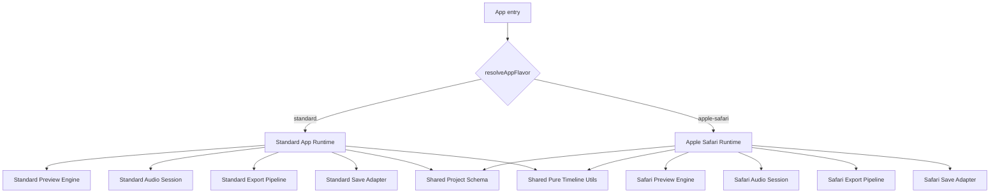

# タートルビデオ プラットフォーム分離再設計方針

作成日: 2026-04-12

## 1. 目的

現状のコードを前提に、タートルビデオが根本的に解決すべき課題を整理し、
Android/PC 系と Apple Safari 系の処理を相互干渉しない形へ再設計できるかを検討する。

本書では次を示す。

- 現状コードから見える根本課題
- Android/PC 系と Apple Safari 系を分離することの可否
- 分離する場合の仕様方針
- 段階的な実装計画

## 2. 結論

### 2.1 対応可否

対応は可能である。

ただし、現状のまま `if (isIosSafari)` を増やしていく方向ではなく、
実行系を二系統に分ける再設計が前提になる。

推奨するのは次の構成である。

- Android/PC 系: 高機能・拡張重視の標準ランタイム
- Apple Safari 系: 安定動作を最優先する互換ランタイム
- 共通で残すもの: プロジェクトデータ形式、純粋なタイムライン計算、受動的な UI 部品
- 共通に残さないもの: 再生制御、AudioContext 制御、プレビュー音声経路、エクスポート経路、保存 I/O の実装詳細

### 2.2 判断理由

現状コードでは、プラットフォーム差分を utility や policy に集約し始めているものの、実際の処理はまだ巨大な共有ランタイムの中で分岐している。
そのため Safari 向け修正が Android/PC 向けの既定経路へ波及しやすい。

特に次の点が大きい。

- `src/App.tsx` は常に単一の `TurtleVideo` を起動している
- `src/components/TurtleVideo.tsx` に preview、audio routing、seek、visibility 復帰、export 前提の処理が集中している
- `src/hooks/useExport.ts` は strategy を持ちつつも、Safari と非 Safari の中核処理を依然として共有している
- `src/utils/previewPlatform.ts` は分離のための helper ではあるが、共有ループ内の条件分岐を減らし切れていない

したがって、今後 Android 側を機能強化し、Safari 側を安定重視にするのであれば、
「同じアプリ内で同じランタイムを分岐で延命する」方針は限界に近い。

## 3. 現状コードから抽出した根本課題

## 3.1 単一ランタイムに責務が集中している

現状の実行入口は 1 本である。

- `src/App.tsx`: 単一の `TurtleVideo` を常に描画
- `src/components/TurtleVideo.tsx`: 再生、停止、seek、visibility 対応、音声 routing、export 前提の同期まで一括保持

この構造だと、どのプラットフォームでも同じ再生エンジンを通る。
Safari 専用の回避策が Android/PC の既定経路に混ざるのは構造上自然であり、運用では防ぎ切れない。

## 3.2 プラットフォーム差分が shared loop に残っている

`src/utils/platform.ts` と `src/utils/previewPlatform.ts` で capability 判定や policy 集約は進んでいるが、
肝心の実行は `TurtleVideo.tsx` 内で継続している。

具体的には次のような分岐が共有ループに残っている。

- `renderFrame`
- `startEngine`
- `stopAll`
- inactive video の `pause/play` 制御
- native audio と WebAudio の切り替え
- visibility 復帰時の AudioContext resume

この状態では、Safari 向けの 1 条件変更が preview 全体の挙動を変えうる。

## 3.3 Export strategy の分離がまだ浅い

`src/hooks/export-strategies/exportStrategyResolver.ts` と
`src/hooks/export-strategies/iosSafariMediaRecorder.ts` により、
strategy 分離の土台自体はある。

しかし実際には `src/hooks/useExport.ts` が次を広く抱え込んでいる。

- Safari 用の offline audio pre-render
- Safari 用の video 要素経由音声抽出
- WebCodecs pipeline
- TrackProcessor / ScriptProcessor の分岐
- muxer / encoder / timeline の管理

さらに `shouldUseOfflineAudioPreRender()` は `isIosSafari` を受け取っているのに、
現実装では「音声ソースがあれば true」を返している。
つまり Safari 向けのはずの重い前処理が非 Safari 側にも共有されている。

これは「strategy が分かれているように見えて、処理本体はまだ十分に分かれていない」ことを示している。

## 3.4 保存と I/O も単一路線で運用している

`src/stores/projectStore.ts` は全プラットフォーム共通で IndexedDB を前提としている。
`src/utils/fileSave.ts` はダウンロード戦略を分けているが、保存の永続化全体は flavor ごとに分かれていない。

現時点ではこのままでも動くが、
Safari 側だけ安定重視の簡素な保存ルートを取りたい場合に選択肢が不足する。

## 3.5 テストが flavor 境界を守る設計になっていない

純粋関数テストは増えているが、
Safari 特有のライフサイクル回帰を検知する層が不足している。

既存メモでも次が確認されている。

- video -> image -> video と BGM を含む iOS 回帰テストが不足
- shared helper を変更すると preview 側の回帰確認が必要

今後も shared runtime を前提に修正を続ける限り、
テストで守るべき境界が増え続ける。

## 4. いま問題になっていることの本質

本質的な問題は「Apple の処理と Android/PC の処理が違うこと」ではない。

本質は次である。

- 振る舞いの違う処理を、1 つの再生エンジンと 1 つの export 中核で扱っている
- 分離すべき責務が utility 化だけで済む段階を超えている
- 将来の開発方針がすでに分岐している
  - Android/PC: リッチ機能を伸ばしたい
  - Safari: 基本機能の安定動作を重視したい

つまり課題は「条件分岐の管理」ではなく「ランタイム分割の不足」である。

## 5. 推奨方針

## 5.1 方針の要点

今後は feature 共通化ではなく、runtime を二系統化する。

ただし、すべてを完全複製するのは推奨しない。
完全複製すると project 互換性や修正コストが悪化するためである。

本プロジェクトで本当に分離すべきなのは次である。

- preview runtime
- audio runtime
- export runtime
- platform ごとの保存 I/O adapter

逆に、次は共通で維持してよい。

- `MediaItem` / `AudioTrack` / `Caption` などのデータ契約
- pure な timeline 計算
- 受動的な UI 部品
- ログ、エラー表現、定数の一部

## 5.2 目標アーキテクチャ



## 5.3 分離後の役割

### Standard Runtime

- 対象: Android Chrome、PC ブラウザ、将来的な高機能路線
- 方針: 機能追加、性能改善、将来的な高度化を優先
- export: WebCodecs を中心に進化
- preview: 通常の play/pause/sync を標準系として保守

### Apple Safari Runtime

- 対象: iPhone / iPad の Safari を主対象とし、必要なら macOS Safari も同系統で扱う
- 方針: 基本機能の安定性を最優先
- export: Safari 用専用 pipeline を独立保守
- preview: AudioSession 保護、pause/play 回避、visibility 復帰などを Safari 専用実装として閉じ込める

## 6. 仕様案

## 6.1 Flavor 定義

```ts
type AppFlavor = 'standard' | 'apple-safari';
```

判定はアプリ入口で一度だけ行う。

```ts
resolveAppFlavor(platformCapabilities): AppFlavor
```

共有モジュール内で `isIosSafari` や `isAndroid` を直接見ることは禁止する。
platform 判定は `resolveAppFlavor` と flavor 内部に閉じ込める。

## 6.2 共通化を許可する範囲

### 共有してよい

- project schema
- pure timeline utility
- store のデータ型
- 汎用 UI 部品
- import / export される保存フォーマット

### 共有してはいけない

- preview 再生エンジン
- AudioContext の復旧戦略
- inactive video の扱い
- visibility 復帰ロジック
- export 実行 pipeline
- platform 固有の file I/O 実装

## 6.3 Safari 側の機能レベル

Safari 側は「標準機能の安定動作」を優先し、機能 parity は必須要件にしない。

最低限守る機能は次とする。

- 動画・画像の追加
- 基本的なトリミング / 表示時間調整
- BGM
- ナレーション
- キャプション
- preview の再生 / 一時停止 / 停止 / seek
- export
- 保存 / 読み込み

将来的な高度機能は standard runtime 側を先行とし、
Safari 側は後追いまたは非搭載を許容する。

## 6.4 データ互換

project データ形式は一本化を維持する。

理由は次の通り。

- Android/PC と Safari で保存ファイルが分かれると運用が煩雑になる
- 将来 runtime を二系統化しても、ユーザーの編集データまで分断すべきではない

そのため、互換ポリシーは次とする。

- 保存フォーマットは共通
- Safari で未サポートの機能は破棄せず保持
- Safari では未対応項目を警告表示または UI で制限

## 6.5 ディレクトリ構成の目安

```text
src/
  app/
    resolveAppFlavor.ts
    AppShell.tsx
  flavors/
    standard/
      StandardApp.tsx
      preview/
      audio/
      export/
      save/
    apple-safari/
      AppleSafariApp.tsx
      preview/
      audio/
      export/
      save/
  shared/
    schema/
    timeline/
    ui/
    logging/
```

## 7. 実装計画

## Phase 0. 文書化と境界宣言

目的:
現状の shared runtime に対して、どこまでを共有し、どこからを flavor 分離するかを明文化する。

タスク:

- 本書を作成
- flavor 境界のルールを決定
- `isIosSafari` の直参照を今後増やさない方針を合意

完了条件:

- 分離対象と共有対象が明文化されている

## Phase 1. App 入口の flavor 分離

目的:
アプリ入口で standard / apple-safari を切り替える。

タスク:

- `resolveAppFlavor()` を追加
- `App.tsx` で runtime を選択
- 現行 `TurtleVideo.tsx` は一旦 adapter として残す

完了条件:

- 入口で flavor 切替が一度だけ行われる
- 下位共有モジュールでの platform 判定を増やさない

## Phase 2. Preview runtime の二系統化

目的:
一番影響の大きい preview / playback / audio routing を flavor ごとに分離する。

タスク:

- `TurtleVideo.tsx` から preview engine を抽出
- standard preview engine を作成
- safari preview engine を作成
- `renderFrame`, `startEngine`, `stopAll`, seek 制御を flavor 側へ移動

完了条件:

- shared 側に preview の platform 条件分岐が残らない
- Safari 修正が standard preview 実装に触れない

## Phase 3. Audio runtime の分離

目的:
AudioContext と media element の扱いを flavor ごとに分離する。

タスク:

- standard audio session を作成
- safari audio session を作成
- createMediaElementSource 再利用制約を Safari 側に閉じ込める
- visibility 復帰 / resume retry を Safari 側に閉じ込める

完了条件:

- shared 側で AudioContext の Safari 回避策を持たない

## Phase 4. Export runtime の分離

目的:
WebCodecs 系と Safari 系の export pipeline を別実装にする。

タスク:

- `useExport.ts` を facade 化
- standard export pipeline を切り出し
- safari export pipeline を切り出し
- `shouldUseOfflineAudioPreRender()` を Safari 用要件へ見直す
- Safari 用の offline render / MediaRecorder / fallback を Safari 側へ隔離

完了条件:

- 非 Safari の export に Safari 専用前処理が残らない
- Safari export 修正が standard export を変更しない

## Phase 5. Save / Load adapter の分離

目的:
データ形式は共通のまま、I/O 実装を flavor ごとに交換可能にする。

タスク:

- project schema を明示化
- `projectStore` から保存実装を adapter 化
- standard save adapter と safari save adapter を用意
- 現時点で IndexedDB を共通維持する場合でも adapter 経由にする

完了条件:

- 永続化方式を flavor 単位で差し替え可能

## Phase 6. UI とヘルプの分離

目的:
機能差を UI レベルで明示し、Safari 側を安定動作モードとして扱えるようにする。

タスク:

- `sectionHelp.ts` の表記を flavor ごとに整理
- Safari 側で未対応機能を出し分け
- standard 側では高度機能の開発を継続可能にする

完了条件:

- ユーザーが platform ごとの期待値を誤認しない

## Phase 7. テスト再編

目的:
shared helper の変更で片系統が壊れる構造をやめ、flavor 単位で回帰を検出する。

タスク:

- standard preview/export テストを用意
- safari preview/export テストを用意
- 共通 schema 互換テストを用意
- iOS 回帰シナリオ
  - video -> image -> video
  - BGM 維持
  - visibility hide/show
  - seek 復帰
  - export 音声維持

完了条件:

- Android/PC 修正時に Safari 回帰が検知できる
- Safari 修正時に Android/PC 回帰が検知できる

## 8. 受け入れ条件

次を満たしたら分離完了とみなす。

- App 入口で flavor が切り替わる
- shared runtime に platform 条件分岐が残っていない
- standard runtime と apple-safari runtime のコード配置が分かれている
- export pipeline が二系統化されている
- project データ互換が維持されている
- standard 側の機能追加で Safari 側の runtime 実装を触らなくてよい
- Safari 側の安定化修正で standard 側の runtime 実装を触らなくてよい

## 9. 非推奨の進め方

次の進め方は避ける。

- `TurtleVideo.tsx` の中で `if (isIosSafari)` をさらに増やす
- previewPlatform helper を増やして shared loop を延命する
- export strategy だけ分けて preview と audio を共有し続ける
- Safari 側の不具合修正を Android/PC 側の既定ロジックへ混ぜ込む

これらは短期的には速いが、今回の目的である「相互干渉の停止」を達成できない。

## 10. リスクと前提

### リスク

- 初期フェーズではファイル数が増える
- `TurtleVideo.tsx` の解体には段階的移行が必要
- 一時的に adapter 層が増えて構造が複雑に見える

### ただし受け入れるべき理由

- 今の複雑さは runtime が 1 本に詰め込まれていることに起因する
- 複雑さを隠すのではなく、境界を明示して局所化する方が保守しやすい

## 11. 保留事項

現時点で仕様上の保留は次である。

- Apple Safari の対象範囲を iPhone / iPad のみにするか、macOS Safari も同じ flavor に含めるか
- Safari 側で許容する機能上限をどこまでにするか
- save/load を当面 IndexedDB 共通のままにするか、Safari 側独自 adapter を早期導入するか

ただし、これらは Phase 1 以降で詰めてもよく、
本書の中核方針である「runtime 二系統化」は変わらない。

## 12. 最終提案

ユーザー意図に沿った最終提案は次である。

- Android と PC は一本の standard runtime にする
- Apple Safari は別の runtime にする
- 同じアプリ、同じ project format は維持する
- 互いの runtime 実装を触らずに改善できる構造へ移行する
- 今後の機能追加は standard 先行、Safari は安定機能を明確に維持する

この方針であれば、
Android 側の機能強化を止めずに進めつつ、Safari 側の安定性も守りやすくなる。